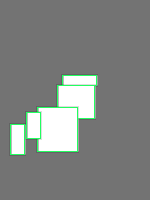
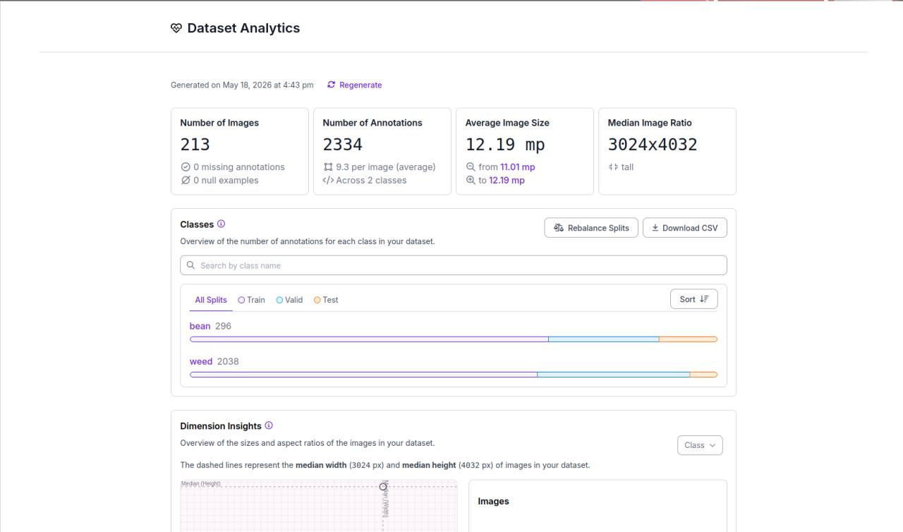
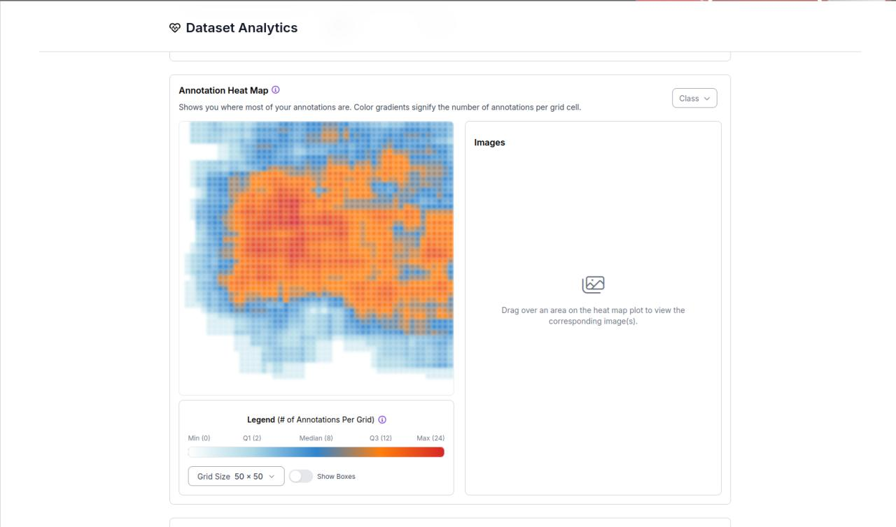

# GanSystem Weed Detection



## AI-Powered Weed Detection for Smart Agriculture

GanSystem Weed Detection is a computer vision project developed to identify weeds within bean farms using machine learning and image recognition techniques.

The project was created as part of the broader GanSystem Smart Agriculture initiative, which focuses on leveraging Artificial Intelligence, IoT, and automation to improve agricultural productivity and decision-making.

---

## Project Overview

Manual weed identification is labor-intensive, time-consuming, and often inconsistent across large agricultural environments.

This project explores the use of AI-powered object detection models to automatically identify weeds and bean crops from farm images, providing a foundation for future precision agriculture and automated weed management systems.

---

## Key Objectives

- Detect weeds within bean farms
- Distinguish crop plants from unwanted vegetation
- Improve farm monitoring through computer vision
- Support future autonomous spraying and precision farming systems
- Build an annotated agricultural dataset for machine learning applications

---

## Dataset Overview

### Dataset Statistics

| Metric | Value |
|----------|----------|
| Images | 213 |
| Annotated Objects | 2,334 |
| Classes | 2 |
| Average Image Size | 12.19 MP |
| Median Resolution | 3024 × 4032 |

### Classes

| Class | Annotations |
|---------|---------|
| Bean | 296 |
| Weed | 2,038 |

---

## Dataset Analytics

### Dataset Overview



The dataset contains 213 agricultural images with 2,334 manually annotated objects distributed across two classes: Bean and Weed.

---

### Annotation Heatmap



Annotation heatmaps were used to analyze object distribution across images and identify dataset coverage patterns.

---

## Data Preparation

### Preprocessing

- Auto-orientation
- Contrast enhancement
- Image resizing to 640×640

### Data Augmentation

- Horizontal Flip
- Random Rotation
- Blur
- Motion Blur
- Noise Injection
- Zoom Augmentation

These augmentation techniques improved dataset diversity and model robustness.

---

## Model Training

The weed detection model was trained using the Roboflow ecosystem and deployed as a computer vision inference pipeline.

### Training Framework

- Roboflow
- YOLO-based Object Detection
- Python
- OpenCV

---

## Model Performance

### Evaluation Metrics

| Metric | Score |
|----------|----------|
| mAP@50 | 65.1% |
| Precision | 42.2% |
| Recall | 81.8% |
| F1 Score | 55.7% |

### Performance Results


The model achieved strong recall performance, demonstrating effectiveness in identifying weed instances within agricultural imagery.

---

## Technologies Used

- Python
- OpenCV
- Roboflow
- YOLO
- Computer Vision
- Machine Learning
- Deep Learning
- Image Processing

---

## Skills Demonstrated

### Artificial Intelligence

- Object Detection
- Computer Vision
- Deep Learning
- Model Evaluation

### Data Science

- Dataset Creation
- Data Annotation
- Data Augmentation
- Performance Analysis

### Engineering

- Python Development
- Image Processing
- Agricultural AI Applications
- Model Deployment Preparation

---

## Repository Structure

```text
gansystem-weed-detection/
│
├── screenshots/
│   ├── cover.png
│   ├── dataset-overview.png
│   ├── annotation-heatmap.png
│   └── model-performance.png
│
├── weed_detection_live.py
├── dataset-overview.md
├── results.md
└── README.md
```

---

## Future Improvements

- Real-time camera integration
- Edge deployment on Jetson Nano
- Mobile weed detection interface
- Automated spray recommendations
- Integration with GanSystem Smart Farm Platform
- Weed density analytics dashboard

---

## Related Project

### GanSystem Smart Agriculture Platform

This project is part of the larger GanSystem ecosystem, which includes:

- Smart Irrigation
- IoT Farm Monitoring
- Fish Farm Automation
- Environmental Monitoring
- Agricultural AI Systems

Repository:

https://github.com/codeandbe/gansystem

---

## Repository Purpose

This repository serves as a portfolio showcase demonstrating practical experience in:

- Computer Vision
- Machine Learning
- Agricultural AI
- Dataset Annotation
- Model Evaluation
- Python Development

---

## Developer

**Iyobosa Amaddin**

GitHub:
https://github.com/codeandbe

LinkedIn:
https://linkedin.com/in/codeandbe

---

## Note

This repository is intended for educational, research, and portfolio demonstration purposes.

The repository showcases the dataset preparation, training workflow, evaluation results, and prototype implementation of an agricultural weed detection system.
